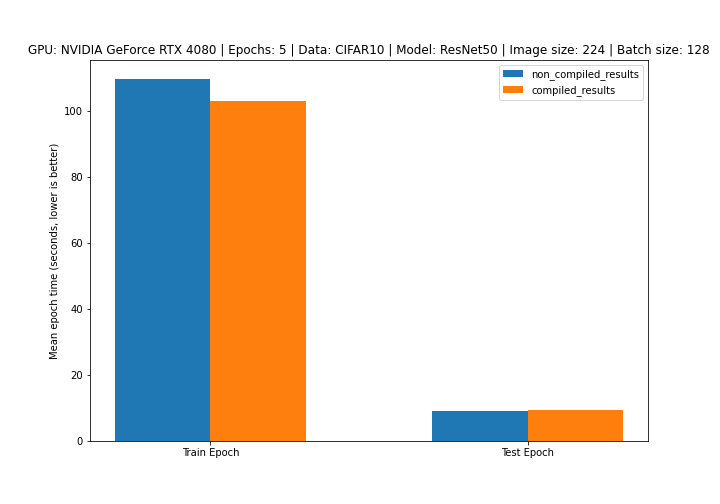
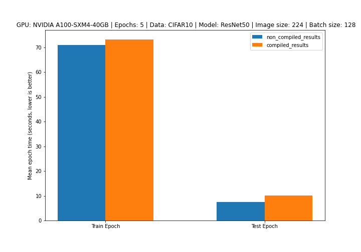
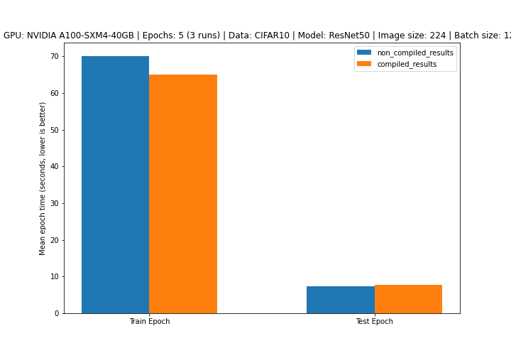

# PyTorch 2.0 Brief Testing Results

## Setup
* **Model:** ResNet50 (from TorchVision)
* **Data:** CIFAR10 (from TorchVision)
* **Epochs:** 5 (single run) and 3x 5 (multiple runs)
* **Batch size:** 128
* **Image size:** 224

See full code in the [PyTorch 2.0 Intro notebook](https://github.com/mrdbourke/pytorch-deep-learning/blob/main/extras/pytorch_2_intro.ipynb).

## Single run (5 epochs once)

### NVIDIA RTX 4080

### NVIDIA A100

## Multi run (5 epochs 3x)

### NVIDIA RTX 4080

### NVIDIA A100

